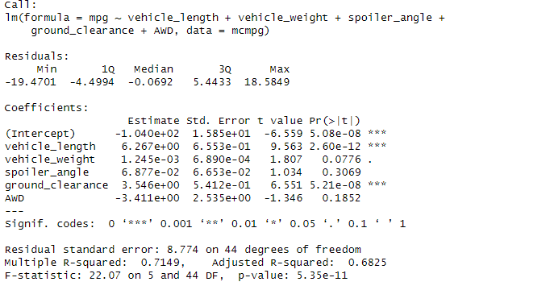

#Mecha Car Statistical Analysis

## Linear Regression to Predict MPG

---

Based on the linear regresson model, we can be assured about a few things.

MechaCar prototypes have been demonstrating that their vehicle length, as well as ground clearance play a major role in the cars resultant mileage per gallon. The high t-value of these two variables suggests that there is a greater difference in these values compared to the other data (with subsequently much lower t-values), insisting that these provide greater evidence against the null hypothesis, and suggesting that they also provide a non-random amount of variance in the dataset.

Given that the p-value of the model is 5.35e-11, this suggests that the slope of the linear model is non-zero. Given that the p-value is 5.35e-11, this is considered statistically significant in that there is enough evidence to assume that within this dataset, our result will fall within a certain "critical region"

The linear model does predict MechaCar prototypes somewhat effectively. A Multiple-R squared value is essentally a measure of the proportion in variation in dependent variables that can be explained by the independent variables (so in our case, the dependent variable is the MPG, the independent is all those listed above).

The linear model has a Residual standard error of 8.77. Typically, the smaller residual standard error is, the more accurate and precise predictions of that model will be.

---

## Summary Statistics on Suspension Coils
---

### Total Summary
.PNG)

---

### Lot Summary

.PNG)

According to the design specifications, the variance of the suspension coils cannot exceed 100 psi. Lots 1 and 2 have low variance in their PSI, however, lot 3 has a significant amount of variance of over +/- ~170 psi. This indicates that there could be an issue either with the data reported due to the significant difference in values, or, there is a significant flaw in the suspension coils that needs to be addressed.

---

## T-Tests on Suspension Coils
---

### All Lot's PSI vs Population Mean

.PNG)

---

### Lot 1 PSI vs Population Mean
---

.PNG)

The data above suggests that there is no difference between the groups other than by chance due to the p-value of 1.

---

### Lot 2 PSI vs Population Mean
---

.PNG)

The data above suggests that, with a p-value of .6072, suggests that there is a significant amount results being affected by chance, and is not a very strong indication of statistical significance.

---

### Lot 3 PSI vs Population Mean
---

.PNG)

The data above suggests that with a p-value of ~ 0.04, there is very low chance that the results collected by chance, and that there is statistical significance for this particular analysis.

---

# Study Design: MechaCar vs Competition

Another potential analysis for the customer could include fuel efficiency for the MechaCar vs comparable models from competitors. It would be easy to test brand new cars, which should be done, but data collected for the MechaCar could also include fuel efficiency at varying levels of mileage vs the competition at varying distances (50,000 or 100,000 miles or 150,000 miles...). Additionally, during this analysis, the customer could also collect data on the need to replace various parts of the car during these distance ranges, or maintnance in general, compared to other available data on competitors. This could possibly give more insight into possible advantages the MechaCar has over other cars without relying on tests for each individual part or variable.